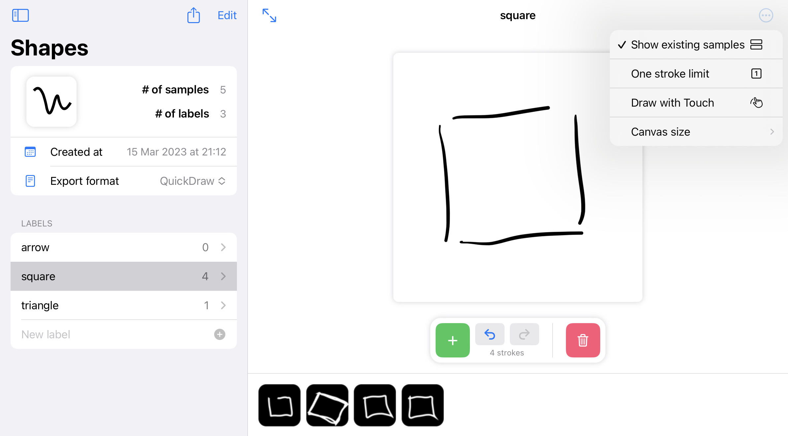

# Online Handwriting Datapal (iOS)

Create datasets for online (stroke-based) handwriting recognition / classification tasks.

## Features
* Create your own labels (classes) and stroke samples from your iPad or iPhone (draw by touch)
* Datasets can be imported / exported to json
* Preview and edit created samples
* Single or multistroke samples supported
* Choose the size of the input canvas
* Written in SwiftUI

## JSON data format
Format of the dataset is the [Google QuickDraw](https://github.com/googlecreativelab/quickdraw-dataset/blob/master/README.md#the-raw-moderated-dataset) `json` format.

Minimal preview can be found [here](preview/shapes-preview.json).

## TODO
* Data persistence (CoreData)
  * this tool was intended for small datasets
  * only a naive data persistence can be achieved in the current version by exporting / importing a json. Use 'Import from JSON' while creating a new dataset.
* Various export formats / file formats (e.g. csv, [IAM style XML](https://fki.tic.heia-fr.ch/databases/iam-on-line-handwriting-database/data-format))

## License
MIT
